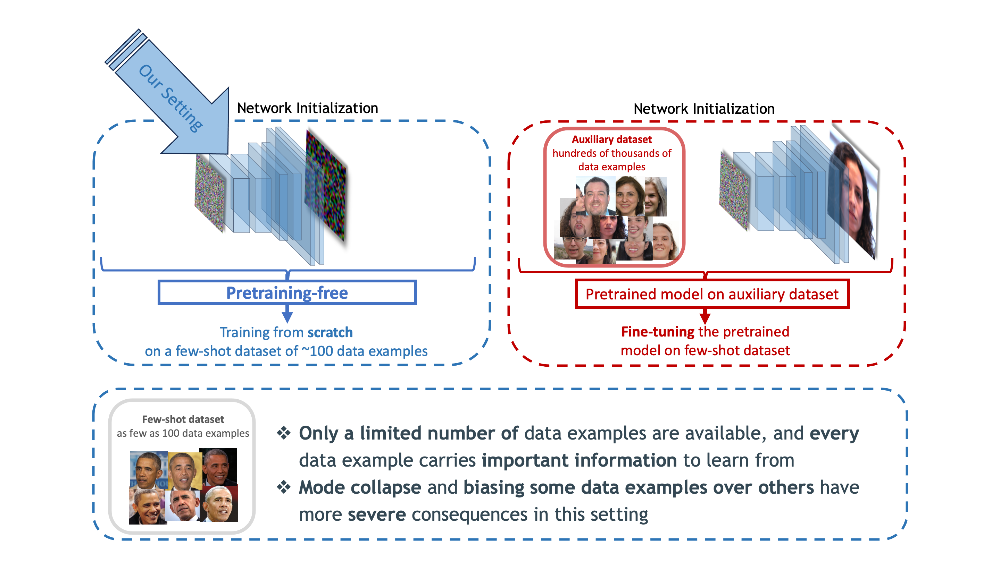

    

        

        <!-- add names next to each other seperated by , -->
            
<a href="https://mehranagh20.github.io/">Mehran Aghabozorgi</a>, <a href="https://sites.google.com/view/niopeng/home">Shichong Peng</a>, <a href="https://www.math.ias.edu/~ke.li/">Ke Li</a>

            
APEX Lab, Simon Fraser University
    
        

    

<!-- add three buttons for Paper, Code and Video -->

    

        

            <li class="list-inline-item btn-shadow">
                <a href="https://github.com/mehranagh20/AdaIMLE" title="Github">
                    
                        <i class="fas fa-circle fa-stack-2x"></i>
                        <i class="fa fa-code fa-stack-1x fa-inverse"></i>
                    
                </a>
            </li>
            <!-- add link to paper https://openreview.net/pdf?id=CNq0JvrDfw -->
            <li class="list-inline-item">
                <a href="https://openreview.net/pdf?id=CNq0JvrDfw" title="Paper">
                    
                        <i class="fas fa-circle fa-stack-2x"></i>
                        <i class="fa fa-file-pdf fa-stack-1x fa-inverse"></i>
                    
                </a>
            </li>
            <li class="list-inline-item">
                <a href="https://www.youtube.com/watch?v=Z3Z3XZ3Z3Z3" title="Video">
                    
                        <i class="fas fa-circle fa-stack-2x"></i>
                        <i class="fa fa-video fa-stack-1x fa-inverse"></i>
                    
                </a>
            </li>
        

    

<!-- add divider in markdown -->
<!-- --- -->

## Overview

We present Adaptive IMLE, a generative modeling approach that covers all the modes and produces high-quality results. Adaptive IMLE is capble of learning from a few samples from scratch without any auxiliary datasets. 

We apply our method to the challenging task of few-shot unconditional image generation with as few as 100 data examples.
<!-- include cenetred image-->

---

### Results

Adaptive IMLE generates high-quality images:

Smooth and meaningful interpolation:

<!-- six rows of ceneted images -->

<!-- add a bit of spacing -->
 

---

Adaptive IMLE trains fast and stably!

---

Adaptive IMLE is capable of learning from even fewer samples without any pretraining or auxiliary datasets!

The following figure shows the results of training Adaptive IMLE on 10-shot datasets.

---

    <h2>Citation</h2>
        <pre  class="citation"><code>@inproceedings{aghabozorgi2023adaimle,
title={Adaptive IMLE for Few-shot Pretraining-free Generative Modelling
},
author={Mehran Aghabozorgi and Shichong Peng and Ke Li},
booktitle={International Conference on Machine Learning},
year={2023}
}</code></pre>
        

